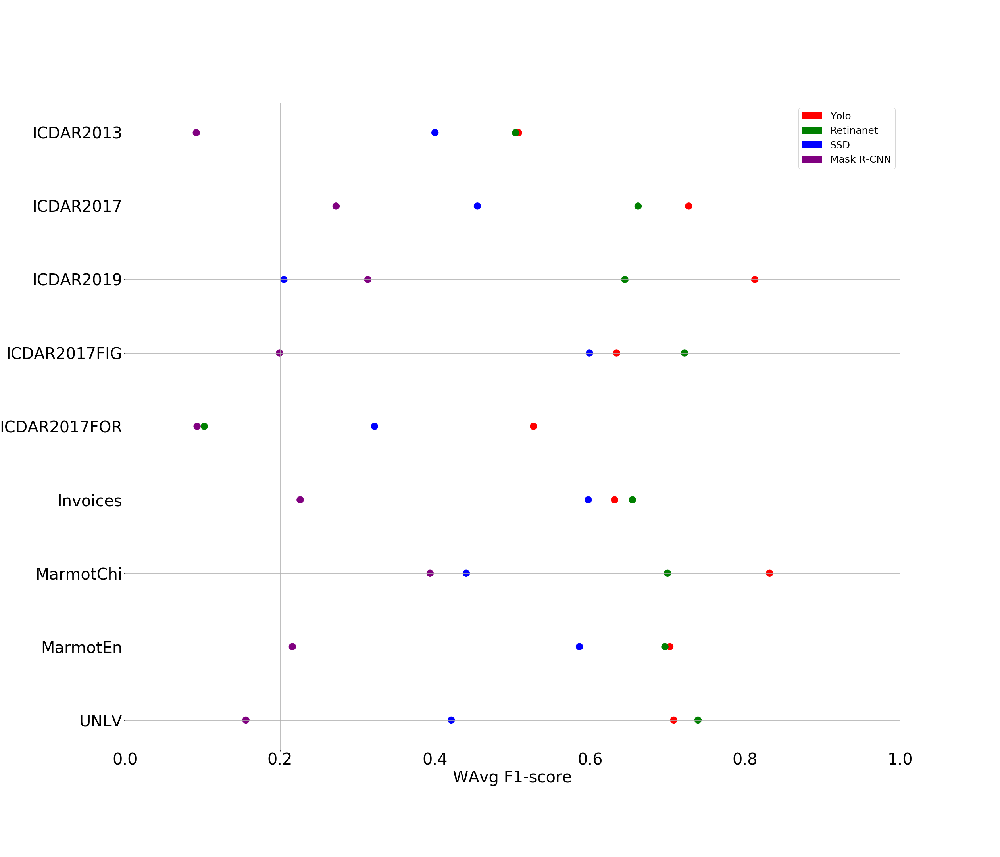

# Model Zoo for table detection

We have trained several models for the following datasets: [ICDAR13](http://www.tamirhassan.com/html/competition.html), [ICDAR17](http://u-pat.org/ICDAR2017/program_competitions.php) (this dataset is used to construct models for detecting tables, figures and formulas), [ICDAR19 modern images](http://sac.founderit.com/), Invoices (a private dataset that is available under request), [Marmot Chinese](http://www.icst.pku.edu.cn/cpdp/sjzy/index.htm), [Marmot English](http://www.icst.pku.edu.cn/cpdp/sjzy/index.htm) and [UNLV](https://dl.acm.org/citation.cfm?id=1815345). Since these datasets do not provide a publicly available test set; we have split the training sets using the partition 75% for training and 25% for testing. The dataset splits are available as follows. 

- ICDAR13: [train set](splits/icdar13-train.txt), [test set](splits/icdar13-test.txt).
- ICDAR17: [train set](splits/icdar17-train.txt), [test set](splits/icdar17-test.txt).
- ICDAR17FIG: [train set](splits/icdar17-train.txt), [test set](splits/icdar17-test.txt).
- ICDAR17FOR: [train set](splits/icdar17-train.txt), [test set](splits/icdar17-test.txt).
- ICDAR19: [train set](splits/icdar19-train.txt), [test set](splits/icdar19-test.txt).
- Invoices: [train set](splits/invoices-train.txt), [test set](splits/invoices-test.txt).
- MarmotChi: [train set](splits/marmotChi-train.txt), [test set](splits/marmotChi-test.txt).
- MarmotEn: [train set](splits/marmotEn-train.txt), [test set](splits/marmotEn-test.txt).
- UNLV: [train set](splits/unlv-train.txt), [test set](splits/unlv-test.txt).

## Fine-tuning from natural images

From models trained with the Pascal VOC dataset, we have created several detection models for the aforementioned datasets using fine-tuning with the algorithms Mask-RCNN, RetinaNet, SSD and YOLO. The results are summarized in the following figure.

The trained models are available in the format used by each framework, and distributed under the [GNU General Public License v3.0](https://www.gnu.org/licenses/gpl-3.0.html)

|| Mask RCNN|RetinaNet|SSD|YOLO|
|----------|----------|----------|----------|----------|
|ICDAR13| [weights](https://unirioja-my.sharepoint.com/:u:/g/personal/cedomin_unirioja_es/EZt0ccT1fxZMhuUzEMP8ZtIBBZMuLHGbvv09vwnn_1hT-A?e=rgshQh)|[weights](https://unirioja-my.sharepoint.com/:u:/g/personal/cedomin_unirioja_es/ETENKY4y9jZKv3dEC-WHlnYBGCP8oUhEzxwZZF9SiJ18jQ?e=wXi696),[classes file](https://raw.githubusercontent.com/holms-ur/fine-tuning/master/code/retinanet/retinanet_classes.csv)| [weights](https://unirioja-my.sharepoint.com/:u:/g/personal/cedomin_unirioja_es/EelJCZ8UY1dAokqj8d0ZGXkBibwrbzb0L_rOdav0F_RPig?e=vYYUcS) |  [weights](https://unirioja-my.sharepoint.com/:u:/g/personal/cedomin_unirioja_es/EU0QwvNmCEtGlu4JSbAP9gQBsR9KIjxQJJLIML6cDy380A?e=L2KNyY), [config file](https://raw.githubusercontent.com/holms-ur/fine-tuning/master/code/yolo/tablasFinaltest416320.cfg), [names file](https://raw.githubusercontent.com/holms-ur/fine-tuning/master/code/yolo/vocTablas.names)|
|ICDAR17| [weights](https://unirioja-my.sharepoint.com/:u:/g/personal/cedomin_unirioja_es/EcyXbl6Ru4tCiZU7PjS9vjsBzP8NNsVrGge8k6hUv7M3FQ?e=YP09Ty)|[weights](https://unirioja-my.sharepoint.com/:u:/g/personal/cedomin_unirioja_es/EfuX-LOhZMRFh1ANtYwcCjsBkOiFQbTzHXnoSb1U265YHw?e=0RghNs),[classes file](https://raw.githubusercontent.com/holms-ur/fine-tuning/master/code/retinanet/retinanet_classes.csv)| [weights](https://unirioja-my.sharepoint.com/:u:/g/personal/cedomin_unirioja_es/EY5sQ97FcalFjxtIYLGuWQkBMkVKtg7kWczqw0XEXAyMig?e=X6SeFw) |  [weights](https://unirioja-my.sharepoint.com/:u:/g/personal/cedomin_unirioja_es/ETMmVrsbVcdGse4R-fOhkocBzJjrIMzaxgn_ovzm7dRteQ?e=k0Okzg), [config file](https://raw.githubusercontent.com/holms-ur/fine-tuning/master/code/yolo/tablasFinaltest416320.cfg), [names file](https://raw.githubusercontent.com/holms-ur/fine-tuning/master/code/yolo/vocTablas.names)|
|ICDAR17FIG| [weights](https://unirioja-my.sharepoint.com/:u:/g/personal/cedomin_unirioja_es/EQnk2KcywL9LhMLEXiWf8PwBEh0wm1aWrZ9siANd0RSbGA?e=1U3Il5)|[weights](https://unirioja-my.sharepoint.com/:u:/g/personal/cedomin_unirioja_es/EQ6kc_ShScNBhfITZldWKmwBjVbYVRWKPN8Zr4U8Z6n2VQ?e=bqcDKS),[classes file](https://raw.githubusercontent.com/holms-ur/fine-tuning/master/code/retinanet/retinanet_classes.csv)| [weights](https://unirioja-my.sharepoint.com/:u:/g/personal/cedomin_unirioja_es/ETarswoK1plDhugNIujdcZoBGp_LaH1lJZnZ7FNA9AY-YQ?e=9QlmwO) |  [weights](https://unirioja-my.sharepoint.com/:u:/g/personal/cedomin_unirioja_es/Eeg-oEPdxl5PuQyjqNedGpMBaYLryQSPZp9HOO6S8acqaQ?e=vVHTsf), [config file](https://raw.githubusercontent.com/holms-ur/fine-tuning/master/code/yolo/tablasFinaltest416320.cfg), [names file](https://raw.githubusercontent.com/holms-ur/fine-tuning/master/code/yolo/vocTablas.names)|
|ICDAR17FOR| [weights](https://unirioja-my.sharepoint.com/:u:/g/personal/cedomin_unirioja_es/EfPGOG8UbEFKrREAnUt7rDkB36nQ-klPAIqD8kb_daV6fQ?e=LGhL0b)|[weights](https://unirioja-my.sharepoint.com/:u:/g/personal/cedomin_unirioja_es/EUfxS7ZwTAtIthw5kS08ffIB4vOFiXagDqfHSRLVBhlzxw?e=9t2O40),[classes file](https://raw.githubusercontent.com/holms-ur/fine-tuning/master/code/retinanet/retinanet_classes.csv)| [weights](https://unirioja-my.sharepoint.com/:u:/g/personal/cedomin_unirioja_es/EV8Qq-r3pWdFsDZhXGeCG1EBwiwZNAZ7SOi2gf3CMmxqhw?e=dfTmYa) |  [weights](https://unirioja-my.sharepoint.com/:u:/g/personal/cedomin_unirioja_es/EX004aBDx0ZGsM4QfX9PoCsBzPddsr38A8A3mIGpSiROLw?e=xWwbFg), [config file](https://raw.githubusercontent.com/holms-ur/fine-tuning/master/code/yolo/tablasFinaltest416320.cfg), [names file](https://raw.githubusercontent.com/holms-ur/fine-tuning/master/code/yolo/vocTablas.names)|
|ICDAR19| [weights](https://unirioja-my.sharepoint.com/:u:/g/personal/cedomin_unirioja_es/ES4DpTRJWs9Ek0v0xMbymOoBNEOPceFsqQs5L9upko6kaA?e=G6UB7p)|[weights](),[classes file](https://raw.githubusercontent.com/holms-ur/fine-tuning/master/code/retinanet/retinanet_classes.csv)| [weights](https://unirioja-my.sharepoint.com/:u:/g/personal/cedomin_unirioja_es/EVvuNHa7amlHk5O_CvVaHu8BFwv1sfXI31qxIOoTJTpmzw?e=bCrRjR) |  [weights](), [config file](https://raw.githubusercontent.com/holms-ur/fine-tuning/master/code/yolo/tablasFinaltest416320.cfg), [names file](https://raw.githubusercontent.com/holms-ur/fine-tuning/master/code/yolo/vocTablas.names)|
|Invoices| [weights](https://unirioja-my.sharepoint.com/:u:/g/personal/cedomin_unirioja_es/ESe1F8OygqxHrzAKlYF0AmUBMauBGsgvxnzyiCIG-yVPKQ?e=80LarN)|[weights](https://unirioja-my.sharepoint.com/:u:/g/personal/cedomin_unirioja_es/EcZ4vdhqm1lHjDi6okTWbEkBTVoZN-6VTlMF6jr9TEF0qw?e=vWWsHs),[classes file](https://raw.githubusercontent.com/holms-ur/fine-tuning/master/code/retinanet/retinanet_classes.csv)| [weights](https://unirioja-my.sharepoint.com/:u:/g/personal/cedomin_unirioja_es/ER20e6yv2T1LkImbu_L2-p0BO6O9LDHv4om7Tp0CDve2ZA?e=neBXoe) |  [weights](https://unirioja-my.sharepoint.com/:u:/g/personal/cedomin_unirioja_es/EVqiaX3VgVZLmTbUBe0kRbQBCf0r1peyo5d_8k3YYJg3FQ?e=R6ZGA3), [config file](https://raw.githubusercontent.com/holms-ur/fine-tuning/master/code/yolo/tablasFinaltest416320.cfg), [names file](https://raw.githubusercontent.com/holms-ur/fine-tuning/master/code/yolo/vocTablas.names)|
|MarmotChi| [weights](https://unirioja-my.sharepoint.com/:u:/g/personal/cedomin_unirioja_es/Ea0TLm8LMwRNnTZ-FXRhnY0B76O3-xMPL96mF_MSc_q9ew?e=kbKhys)|[weights](https://unirioja-my.sharepoint.com/:u:/g/personal/cedomin_unirioja_es/ERIcHRYk3bJFgPziH3WhvVwBO_-xx-HdNUwfmiv2S45A-A?e=1bzjp3),[classes file](https://raw.githubusercontent.com/holms-ur/fine-tuning/master/code/retinanet/retinanet_classes.csv)| [weights](https://unirioja-my.sharepoint.com/:u:/g/personal/cedomin_unirioja_es/ERBbJ6TX_KlGkBhryc7fqAEBaGdFVyc62cHrswMC7mCL7g?e=sPI2vT) |  [weights](https://unirioja-my.sharepoint.com/:u:/g/personal/cedomin_unirioja_es/EeypoDUR2TxPqKoymbZJxNsBYwocn1F_cTikDXKBk1iKhg?e=ET6CAV), [config file](https://raw.githubusercontent.com/holms-ur/fine-tuning/master/code/yolo/tablasFinaltest416320.cfg), [names file](https://raw.githubusercontent.com/holms-ur/fine-tuning/master/code/yolo/vocTablas.names)|
|MarmotEn| [weights](https://unirioja-my.sharepoint.com/:u:/g/personal/cedomin_unirioja_es/EUodMOOCQZlEs0xzV3j6zd0BiuxOM-Z4uU5OspdoFF1mZA?e=SwEnyB)|[weights](https://unirioja-my.sharepoint.com/:u:/g/personal/cedomin_unirioja_es/Edi3QTUsUh1GpFUu3DV1KrYBZUCBheGymXDrQKyG7FdZmA?e=NPa4Pt),[classes file](https://raw.githubusercontent.com/holms-ur/fine-tuning/master/code/retinanet/retinanet_classes.csv)| [weights](https://unirioja-my.sharepoint.com/:u:/g/personal/cedomin_unirioja_es/ETH5QCMa_aBKsjxl9uz4PvoBAi3UB8ST9cC8ub6CjEQ7Ig?e=KjR1Cm) |  [weights](https://unirioja-my.sharepoint.com/:u:/g/personal/cedomin_unirioja_es/EXq35-moQl1MoM_PM5VuJE4BLjeXAET7mXfGmUNIRtmiVg?e=asCckz), [config file](https://raw.githubusercontent.com/holms-ur/fine-tuning/master/code/yolo/tablasFinaltest416320.cfg), [names file](https://raw.githubusercontent.com/holms-ur/fine-tuning/master/code/yolo/vocTablas.names)|
|UNLV| [weights](https://unirioja-my.sharepoint.com/:u:/g/personal/cedomin_unirioja_es/ERNBdsLqIplJsJsETytzkQ8B0RnkxtPNIu5CMmH_TC6RUQ?e=NIuW5J)|[weights](https://unirioja-my.sharepoint.com/:u:/g/personal/cedomin_unirioja_es/ETft6nXCka1LppxRVmkXjhgBFx0e7UkTdJWigxnbox4MFQ?e=D9lrHP),[classes file](https://raw.githubusercontent.com/holms-ur/fine-tuning/master/code/retinanet/retinanet_classes.csv)| [weights](https://unirioja-my.sharepoint.com/:u:/g/personal/cedomin_unirioja_es/EelAgmqunwZLi8uylh666CwBH4XiqNpJPCDG1RgYjvaIRA?e=OsQ824) |  [weights](https://unirioja-my.sharepoint.com/:u:/g/personal/cedomin_unirioja_es/EVA4H2k4O4ZDvO-SlYE5l0wBS0L_7_KOXNI9_RmVQvcQfw?e=5dGGZS), [config file](https://raw.githubusercontent.com/holms-ur/fine-tuning/master/code/yolo/tablasFinaltest416320.cfg), [names file](https://raw.githubusercontent.com/holms-ur/fine-tuning/master/code/yolo/vocTablas.names)|

## Fine-tuning from the TableBank dataset

From models trained with the TableBank dataset, we have created several detection models for the aforementioned datasets using fine-tuning with the algorithms Mask-RCNN, RetinaNet, SSD and YOLO. The results are summarized in the following figure.

The trained models are available in the format used by each framework, and distributed under the [GNU General Public License v3.0](https://www.gnu.org/licenses/gpl-3.0.html)

|| Mask RCNN|RetinaNet|SSD|YOLO|
|----------|----------|----------|----------|----------|
|ICDAR13| [weights](https://unirioja-my.sharepoint.com/:u:/g/personal/cedomin_unirioja_es/EW6r_5Pkp8VLql9yITI0hSUBfE-Ht6yLH746g0LcN3emyg?e=UYHr6d)|[weights](https://unirioja-my.sharepoint.com/:u:/g/personal/cedomin_unirioja_es/EWNyYcH_QhpGhNXhA8F608oBnwAFmFO2uRhY7dA5DzgAQw?e=evMw0i),[classes file](https://raw.githubusercontent.com/holms-ur/fine-tuning/master/code/retinanet/retinanet_classes.csv)| [weights](https://unirioja-my.sharepoint.com/:u:/g/personal/cedomin_unirioja_es/EV7aob0jsnFCtHia0uc_eNYBzcMZk9wu8wrbXfLqxuVAvQ?e=713cWz) |  [weights](https://unirioja-my.sharepoint.com/:u:/g/personal/cedomin_unirioja_es/EU2UHSi2X7ZHhUgkWVBZmcABDSbzxBL-cdXijp47gbrfLw?e=mXYm7i), [config file](https://raw.githubusercontent.com/holms-ur/fine-tuning/master/code/yolo/tablasFinaltest416320.cfg), [names file](https://raw.githubusercontent.com/holms-ur/fine-tuning/master/code/yolo/vocTablas.names)|
|ICDAR17| [weights](https://unirioja-my.sharepoint.com/:u:/g/personal/cedomin_unirioja_es/Ed6Kye5WXydNq323I8v6_b4BnxANqiP7HY9P7PrSrLxqew?e=MBywNB)|[weights](https://unirioja-my.sharepoint.com/:u:/g/personal/cedomin_unirioja_es/Ea6zj5YFSGdKoikX1WB2JjUBtks4KXjEJRSrAlkGLh_sAQ?e=na1KNN),[classes file](https://raw.githubusercontent.com/holms-ur/fine-tuning/master/code/retinanet/retinanet_classes.csv)| [weights](https://unirioja-my.sharepoint.com/:u:/g/personal/cedomin_unirioja_es/EYVzMx6r3KVBmfb_sCX0cJoBzzFBiqP5J58-f7usqeEcxA?e=rukDe0) |  [weights](https://unirioja-my.sharepoint.com/:u:/g/personal/cedomin_unirioja_es/ESh0c7AYAERFo1mW0jx5UtkB9sFrOyLIbCC8ZzKM4UWtXg?e=7BC2yA), [config file](https://raw.githubusercontent.com/holms-ur/fine-tuning/master/code/yolo/tablasFinaltest416320.cfg), [names file](https://raw.githubusercontent.com/holms-ur/fine-tuning/master/code/yolo/vocTablas.names)|
|ICDAR17FIG| [weights](https://unirioja-my.sharepoint.com/:u:/g/personal/cedomin_unirioja_es/EVCNvZXvL4dLnSyFIHTv46UBhhyxeDsDT54v3IGT1sKq9g?e=svmrCD)|[weights](https://unirioja-my.sharepoint.com/:u:/g/personal/cedomin_unirioja_es/EYq7Op99i_xJi39AiLyZ3bUBKLjqon5uNsq7x3bm3SoPaw?e=NXozvP),[classes file](https://raw.githubusercontent.com/holms-ur/fine-tuning/master/code/retinanet/retinanet_classes.csv)| [weights](https://unirioja-my.sharepoint.com/:u:/g/personal/cedomin_unirioja_es/EU762V1cV3dBsz8rgfrmA-8BFkXWj5UMTzfYZQTw0yMXfw?e=AH017T) |  [weights](https://unirioja-my.sharepoint.com/:u:/g/personal/cedomin_unirioja_es/Ee-xiC8-sTxMjKiLPGT0wcQBORVUlOpjFc81Q47ow4BOQQ?e=DMjCkX), [config file](https://raw.githubusercontent.com/holms-ur/fine-tuning/master/code/yolo/tablasFinaltest416320.cfg), [names file](https://raw.githubusercontent.com/holms-ur/fine-tuning/master/code/yolo/vocTablas.names)|
|ICDAR17FOR| [weights](https://unirioja-my.sharepoint.com/:u:/g/personal/cedomin_unirioja_es/EeCnHcLNlhNMjp1b2aAyY9YBlVHmSdIDyQFSvyUWQjpvWg?e=ItMBcp)|[weights](https://unirioja-my.sharepoint.com/:u:/g/personal/cedomin_unirioja_es/EdeBMpQ0Le5OrxGBZEsIK08BBX4qEptUlaEgEF9mKs2oDQ?e=ZfOHSz),[classes file](https://raw.githubusercontent.com/holms-ur/fine-tuning/master/code/retinanet/retinanet_classes.csv)| [weights](https://unirioja-my.sharepoint.com/:u:/g/personal/cedomin_unirioja_es/EW-9tHi7DA1HuFRwOiOweXYBZmuFDArGEDfh5oIvcqvXag?e=K0UnGp) |  [weights](https://unirioja-my.sharepoint.com/:u:/g/personal/cedomin_unirioja_es/EQL6UcTvV7ZHgsiZBptIMGEB-uMPAytxpEIPdPMIFF8OMg?e=eGq4cG), [config file](https://raw.githubusercontent.com/holms-ur/fine-tuning/master/code/yolo/tablasFinaltest416320.cfg), [names file](https://raw.githubusercontent.com/holms-ur/fine-tuning/master/code/yolo/vocTablas.names)|
|ICDAR19| [weights](https://unirioja-my.sharepoint.com/:u:/g/personal/cedomin_unirioja_es/Efpn662iHlpMifFzZ3VHbBQBiXsBNuxgQIRy2--hG-gmsw?e=ZtegwB)|[weights](),[classes file](https://raw.githubusercontent.com/holms-ur/fine-tuning/master/code/retinanet/retinanet_classes.csv)| [weights](https://unirioja-my.sharepoint.com/:u:/g/personal/cedomin_unirioja_es/EcGBtd94dRZOnbr5ZDuJL8gBi0kyOc7LGqYXH6jTKyX5FQ?e=OfrOJf) |  [weights](), [config file](https://raw.githubusercontent.com/holms-ur/fine-tuning/master/code/yolo/tablasFinaltest416320.cfg), [names file](https://raw.githubusercontent.com/holms-ur/fine-tuning/master/code/yolo/vocTablas.names)|
|Invoices| [weights](https://unirioja-my.sharepoint.com/:u:/g/personal/cedomin_unirioja_es/EewTVVDVAGdAoyGwzSy2f3wBiUJikPmnPX_I48c2QJRvNg?e=JQ300q)|[weights](https://unirioja-my.sharepoint.com/:u:/g/personal/cedomin_unirioja_es/EVuCztrCBvJFqyAQl8IFeyIByylYou-c4wogaMfXAGNHZQ?e=IjFfIM),[classes file](https://raw.githubusercontent.com/holms-ur/fine-tuning/master/code/retinanet/retinanet_classes.csv)| [weights]() |  [weights](https://unirioja-my.sharepoint.com/:u:/g/personal/cedomin_unirioja_es/EYrBpkAnuo5FjeH52SSS4o8BjYBXDbQ62b2U43xysw2Z1A?e=yLbe9L), [config file](https://raw.githubusercontent.com/holms-ur/fine-tuning/master/code/yolo/tablasFinaltest416320.cfg), [names file](https://raw.githubusercontent.com/holms-ur/fine-tuning/master/code/yolo/vocTablas.names)|
|MarmotChi| [weights](https://unirioja-my.sharepoint.com/:u:/g/personal/cedomin_unirioja_es/EdPdxmprlGNIsqDssw9qiyAB1XxW5Ffzdhe5-r9cSMTlqg?e=dgTRqD)|[weights](https://unirioja-my.sharepoint.com/:u:/g/personal/cedomin_unirioja_es/EffRr51kAzBAkOq8dAHVK54BhXBoOJyS9twk74-EDm1tvg?e=gMeDOG),[classes file](https://raw.githubusercontent.com/holms-ur/fine-tuning/master/code/retinanet/retinanet_classes.csv)| [weights](https://unirioja-my.sharepoint.com/:u:/g/personal/cedomin_unirioja_es/ESJykgLeXIhHjTf54qqgc14BHAa_ycul_ToNMwVLS66weQ?e=doecLi) |  [weights](https://unirioja-my.sharepoint.com/:u:/g/personal/cedomin_unirioja_es/ESZGsuGCX0hCirvi1ueu62EBT_IIiHXhprKJiDIfoNXzvg?e=XIcu3a), [config file](https://raw.githubusercontent.com/holms-ur/fine-tuning/master/code/yolo/tablasFinaltest416320.cfg), [names file](https://raw.githubusercontent.com/holms-ur/fine-tuning/master/code/yolo/vocTablas.names)|
|MarmotEn| [weights](https://unirioja-my.sharepoint.com/:u:/g/personal/cedomin_unirioja_es/EfB0ofSW21tFsy8wOOWVnusBaGbhuHjpw96vTrNcdE2lpQ?e=rt8Pre)|[weights](https://unirioja-my.sharepoint.com/:u:/g/personal/cedomin_unirioja_es/EdbvWcKPM9FFjYo9Pr_tQ8wBLb3x2WTyHC-qdv0maMUwew?e=EyvhJe),[classes file](https://raw.githubusercontent.com/holms-ur/fine-tuning/master/code/retinanet/retinanet_classes.csv)| [weights](https://unirioja-my.sharepoint.com/:u:/g/personal/cedomin_unirioja_es/EWyTiUNYnMhOmZYRqeHJR8wBSgQ0h99i6HB29CVgSOvgkA?e=GLYxSj) |  [weights](https://unirioja-my.sharepoint.com/:u:/g/personal/cedomin_unirioja_es/ES_T96i_HmBLqFL3d-vBUTUBHmwN7sJY4YBhxvqk9lApHw?e=jGdx0l), [config file](https://raw.githubusercontent.com/holms-ur/fine-tuning/master/code/yolo/tablasFinaltest416320.cfg), [names file](https://raw.githubusercontent.com/holms-ur/fine-tuning/master/code/yolo/vocTablas.names)|
|UNLV| [weights](https://unirioja-my.sharepoint.com/:u:/g/personal/cedomin_unirioja_es/Eagi7PrqQTxEv3PiVZB6RxYBssrcC2kGPMVbrUkrm3nYEg?e=DzYvxy)|[weights](https://unirioja-my.sharepoint.com/:u:/g/personal/cedomin_unirioja_es/ERGZhy0kC91GrqnJd1GuhdQBka4nC3qpzolsVOCxmIHVgQ?e=Axjjna),[classes file](https://raw.githubusercontent.com/holms-ur/fine-tuning/master/code/retinanet/retinanet_classes.csv)| [weights](https://unirioja-my.sharepoint.com/:u:/g/personal/cedomin_unirioja_es/EQsdYjN32YVPlKCIeMIPR7sBawIRQnwEZPL7OHdRQv9DtA?e=i0spv8) |  [weights](https://unirioja-my.sharepoint.com/:u:/g/personal/cedomin_unirioja_es/EYFwrK7aiaVDqYHLRqy_qqABTNdoiiwibRrKPVACJYbCvw?e=G0m8qg), [config file](https://raw.githubusercontent.com/holms-ur/fine-tuning/master/code/yolo/tablasFinaltest416320.cfg), [names file](https://raw.githubusercontent.com/holms-ur/fine-tuning/master/code/yolo/vocTablas.names)|

## Comparison of models

In the next table, we compare the [WF1Avg score](http://sac.founderit.com/evaluation.html) obtained by the models fine-tuned from models constructed using natural images, and the models constructed using the TableBank dataset.

||Mask R-CNN Natural| Mask R-CNN TableBank |RetinaNet Natural| RetinaNet TableBank |SSD Natural| SSD TableBank |YOLO Natural| YOLO TableBank |
|----------|----------|----------|----------|----------|----------|----------|----------|----------|
|ICDAR13|0.09|0.72|0.5|0.74|0.4|0.52|0.50|0.66|
|ICDAR17|0.27|0.72|0.66|0.84|0.45|0.47|0.72|0.82|
|ICDAR17FIG|0.19|0.29|0.72|0.72|0.59|0.29|0.63|0.71|
|ICDAR17FOR|0.09|0.06|0.1|0.2|0.32|0.35|0.52|0.59|
|ICDAR19|0.31|0.65|0.64|0.72|0.2|0.23|0.81|0.85|
|Invoices|0.22|0.44|0.65|0.66|0.59|0.66|0.63|0.69|
|MarmotChi|0.21|0.70|0.69|0.84|0.58|0.64|0.7|0.87|
|MarmotEn|0.39|0.82|0.70|0.8|0.44|0.45|0.83|0.85|
|UNLV|0.15|0.55|0.73|0.74|0.42|0.49|0.7|0.77|
